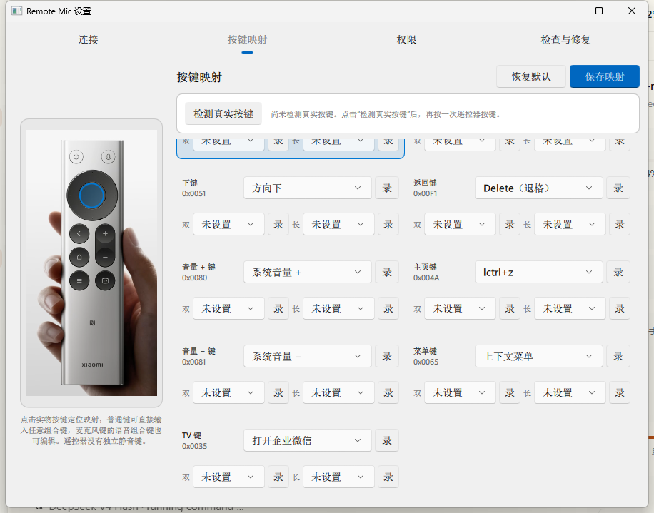

# Remote Mic · Windows 版本（RC003）

这是 `miaomiaozii/windows-remote-mic-app` 仓库，面向小米蓝牙遥控器 2 Pro（RC003）的 Windows 蓝牙桥接软件：把遥控器的按键和语音转成 Windows 能识别的键盘按键与语音输入，从而在电脑上操控豆包、微信、WPS 等应用。macOS 应用、Swift 工程和 macOS 发布资源不属于本仓库。

Windows 客户端位于 [`apps/windows/rc003`](apps/windows/rc003/README.md)，提供：

- WinRT BLE 连接与 ATVV 语音解码；
- Windows Raw Input + Frida HID 旁路按键监听，SendInput 按键映射；
- 语音输出到用户明确选择的音频端点（配合虚拟声卡供输入法识别）；
- PySide6/Qt Quick 设置窗口、诊断和 PyInstaller 便携版构建。

当前版本是**Windows RC003 源码/构建候选版**：源码测试、PyInstaller 打包和启动
冒烟检查已完成，并在一台真实 Windows 电脑上完成返回键、音量+、音量−实体按键
验收。不同电脑的蓝牙配对、管理员权限、HID 旁路、VB-CABLE 和输入法状态会影响
最终效果；CI 和自动构建不能替代真机配对、按键和语音链路验收。产物未签名。

## 截图




> 截图在 Windows 11 + RC003 实测环境拍摄；如与你的系统主题/分辨率不同属正常差异。

## 下载与安装

最新正式版：[v0.1.0-windows](https://github.com/miaomiaozii/windows-remote-mic-app/releases/tag/v0.1.0-windows)。

从 Release 页面 Assets 下载便携版：

| 资产 | 适用场景 |
| --- | --- |
| `RemoteMicRC003-0.1.0-candidate-portable-unsigned.zip` | 免安装，解压到任意目录直接运行 |

便携 ZIP 未签名，Windows SmartScreen 可能提示，点“更多信息 → 仍要运行”即可。
建议同时下载 `SHA256SUMS.txt` 校验文件哈希。Release 中的 ZIP 和校验文件来自同一次
Windows CI 构建。

## 快速开始（便携版）

1. 下载 ZIP，解压到短路径，例如 `D:\RemoteMicRC003`；
2. 双击 `RemoteMicRC003.exe` 打开设置窗口；
3. 在 Windows 设置 → 蓝牙中把 RC003 遥控器与电脑配对；
4. 回到设置窗口的“连接与配置”页，按页面顺序点击“连接”、准备语音通道并完成测试；
5. 第一次连接时，程序会自动准备完整按键能力；如果 Windows 弹出授权提示，按说明确认；
6. 按遥控器方向键、OK、返回或音量键验证映射。麦克风键会启动当前选择的语音软件。
   停止程序时，在任务管理器结束 `RemoteMicRC003.exe`。

详细配对、虚拟声卡配置、按键映射和故障排查见
[`apps/windows/rc003/README.md`](apps/windows/rc003/README.md)。

## 从源码本地运行

在 Windows PowerShell 中执行：

```powershell
Set-Location apps/windows/rc003
python -m venv .venv
.\.venv\Scripts\python.exe -m pip install -r requirements-dev.txt
$env:PYTHONPATH = Join-Path (Get-Location) 'src'
.\.venv\Scripts\python.exe -m ovb_rc003 --settings
```

运行桥接（单独的桥接进程）：

```powershell
.\.venv\Scripts\python.exe -m ovb_rc003 --bridge
```

运行测试：

```powershell
.\.venv\Scripts\python.exe -m unittest discover -s tests -t . -p 'test_*.py' -v
```

构建未签名便携版候选：

```powershell
.\build\build-candidate.ps1
```

完整安装、配对、VB-CABLE 配置、已知限制和发布流程见 [`apps/windows/rc003/README.md`](apps/windows/rc003/README.md)。

## 仓库内容分工

- `apps/windows/rc003/src/`：客户端源码、QML 界面和按键/语音逻辑；
- `apps/windows/rc003/tests/`：跨平台单元测试、Windows 测试和构建契约测试；
- `apps/windows/rc003/README.md`、`CHANGELOG.md`、`ATTRIBUTION.md`：公开使用说明、版本记录和来源说明；
- `apps/windows/rc003/build/`、`.github/workflows/`：本地构建脚本、PyInstaller 配置和 GitHub CI；
- `apps/windows/rc003/dist*/`、`build/pyinstaller-work*/`：本地生成物，已排除在源码提交之外。

当前公开发布只提供便携 ZIP，不在 CI 编译或上传安装器。ZIP 体积较大，适合放在
GitHub Release 资产中，不适合提交进 Git 历史。

## 仓库来源

- **Fork 自**：[`HD838A/remote-mic-app`](https://github.com/HD838A/remote-mic-app)（无线麦 Remote Mic：把小米蓝牙遥控器 2 Pro / RC003 变成 Mac 语音输入设备）。本仓库只保留并继续维护其中的 Windows RC003 部分，macOS/Swift 部分不在此仓库维护。
- **Windows 上游参考实现**：[`nijez/open-voice-bridge`](https://github.com/nijez/open-voice-bridge)（GPL-3.0-only），提供 WinRT BLE、ATVV 语音协议、Raw Input、SendInput 和 Qt/QML 设置页的参考实现。
- **RC003 HID 旁路参考**：[`xxb26553663-star/remote-bridge-hub`](https://github.com/xxb26553663-star/remote-bridge-hub)（GPL-3.0-only），提供用 Frida Gadget 读取 Windows 普通输入链路拿不到的 RC003 返回/音量 HID 报告的实现思路。

Windows 实现的改动说明与第三方边界见
[`apps/windows/rc003/ATTRIBUTION.md`](apps/windows/rc003/ATTRIBUTION.md)、
[`COPYRIGHT.md`](COPYRIGHT.md) 和 [`THIRD_PARTY_NOTICES.md`](THIRD_PARTY_NOTICES.md)。

## 许可证

代码按 `GPL-3.0-only` 发布。完整许可证见 [`LICENSE.md`](LICENSE.md)。

## 维护边界

- 主程序源码只在 `apps/windows/rc003`；
- Windows CI 位于 `.github/workflows/windows-rc003-ci.yml`；
- `device-profiles` 只保留 Windows 客户端使用的设备目录；
- `LICENSE.md`、`COPYRIGHT.md`、`THIRD_PARTY_NOTICES.md` 和
  [`apps/windows/rc003/ATTRIBUTION.md`](apps/windows/rc003/ATTRIBUTION.md) 保留 GPL
  与上游来源义务，不代表继续维护原 macOS 应用。
